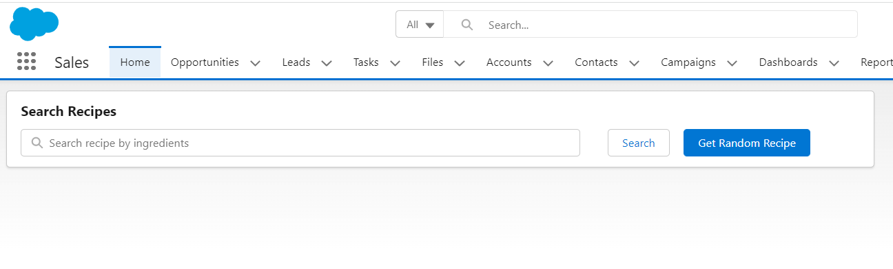

<h2> Recipe (Apex Integration) </h2>

 In this project I have used spoonacular.com API's to fetch receipes for particular Food Item or an Random Recipe 

 At first there is one Search bar where you can inset name of item for which you want receipe and another button is to get any random receipe (If you wanna try somehing new :) ) 

 Now once you enter any item name lets say "Banana" then it will query form  spoonacular API and will list out different receipes for your entered item in my case banana

 Now just click on Get Full Receipe To get the Full receipe for dish you like

 Get Random Receipe option will give you any one random receipe

